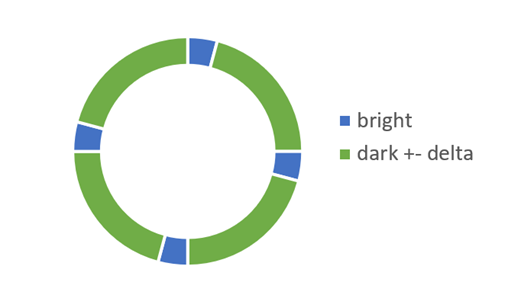

# TransLove
## 主題
利用風扇的轉動及人眼視覺暫留，讓一排LED顯示2D畫面

## 簡介
互動風扇：使用者透過手機app傳送欲顯示的資訊，讓風扇轉動時畫面以跑馬燈的方式顯示出來

動畫風扇：顯示時間以及一些動畫效果

## 實作細節
互動風扇：以circular array儲存資訊，因此一定長度後會開始覆蓋原先的資訊

動畫風扇：

感謝TransLove組員拍的[影片](https://drive.google.com/file/d/1thJAmzimf2tKKtVldifW-y-2IbbCIKAz/view)
