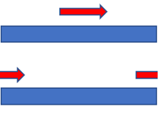

# TransLove LED Fan
## 主題
利用風扇的轉動及人眼視覺暫留，讓一排LED顯示2D畫面

## 簡介
互動風扇
+ 使用者透過手機app傳送欲顯示的資訊，讓風扇轉動時畫面以跑馬燈的方式顯示出來

動畫風扇
+ 顯示時間以及一些動畫效果

## 實作細節
互動風扇
+ 以circular array儲存資訊，因此一定長度後會開始覆蓋原先的資訊

動畫風扇
+ 行走
  + 切換圖案
+ 分身
  + 控制 bright 的有無
+ 移动
  + 改變各區段 delta 的大小及其符號（程式中的"move"）
  

+ 箭頭移動但字母及愛心不動
  + 每個圖案都有固定的起始點而箭頭的起始點是可移動的，且在箭頭『消失』中途其實會有一些瞬間存在兩個箭頭來銜接，看起來好像只有一個箭頭在轉圈							 

+ 箭頭穿越字母與愛心
  + 用 bitwise 的 or 來決定每一個位置該亮什麼圖案，因此重疊不受影響
+ 箭頭加速度（離開愛心與回到愛心的速度不同）
  + 控制箭頭起始點移動的快慢
+ 箭頭帶動整個圖形往前衝
  + 推測是一回合結束後的額外計算讓整個delay而順著風扇轉動的方向旋轉，化 bug 為效果 (?)
  
## Video Link
感謝TransLove組員拍的[影片](https://drive.google.com/file/d/1thJAmzimf2tKKtVldifW-y-2IbbCIKAz/view)
